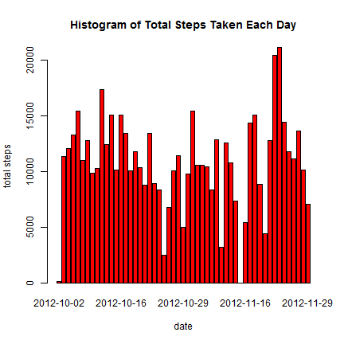
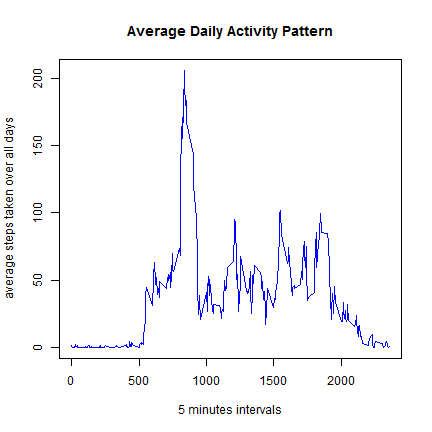
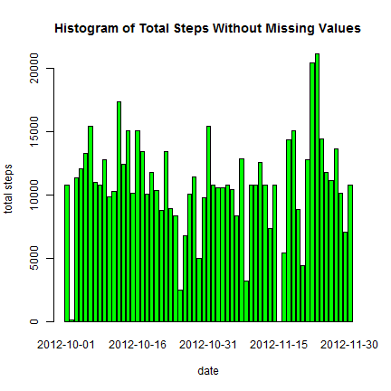
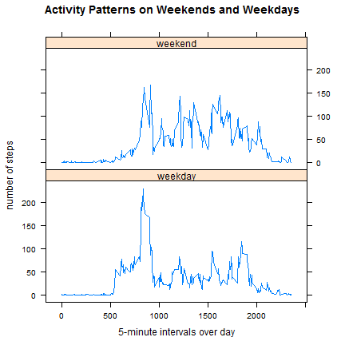

# Reproducible Research: Peer Assessment 1


## Loading and preprocessing the data
### unzip the file and read data into R


```r
# unzip the dataset and load data into R
myds <- read.csv(unz("activity.zip", "activity.csv"))
```


## What is mean total number of steps taken per day?
### Make a histogram of the total number of steps taken each day


```r
# compute the total steps taken each day
step.day <- aggregate(steps ~ date, data = myds, FUN = sum)
```


```r
# Make a histogram of the total number of steps taken each day
barplot(step.day$steps, names.arg = step.day$date, main = "Histogram of Total Steps Taken Each Day", 
    xlab = "date", ylab = "total steps", col = "red")
```

 

### Calculate and report the mean and median total number of steps taken per day

```r
# Calculate the mean total number of steps taken per day
step.mean <- mean(step.day$steps)
# Calculate the median total number of steps taken per day
step.median <- median(step.day$steps)
```

#### The mean total number of steps taken each day is 10766
#### The median total number of steps taken each day is 10765

## What is the average daily activity pattern?
### Make a time series plot of the 5-minute interval (x-axis) and the average number of steps taken, averaged across all days (y-axis).

```r
# compute the average number of steps taken per 5 minutes interval
interval.mean <- aggregate(steps ~ interval, data = myds, FUN = mean)
```


```r
# Make the time series plot
plot(interval.mean, type = "l", main = "Average Daily Activity Pattern", xlab = "5 minutes intervals", 
    ylab = "average steps taken over all days", col = "blue")
```

 

### Which 5-minute interval, on average across all the days in the dataset,contains the maximum number of steps?

```r
# Get the interval contains max average number of steps
interval.max <- subset(interval.mean, interval.mean$steps == max(interval.mean$steps))
```

#### The 5-minute interval, on average across all the days in the dataset, contains the maximum number of steps (206.1698) is 835

## Imputing missing values
### Calculate and report the total number of missing values in the dataset

```r
# Calculate the total number of missing values in the dataset
count.na <- sum(is.na(myds))
```

#### The total number of rows with missing value is 2304

### Filling all the missing steps with the mean of the 5 minutes interval

```r
# create a new dataset from the old dataset
newds <- myds
# Replacing the missing steps with the mean of the 5 minutes interval mean
# across all day
for (i in 1:nrow(newds)) {
    if (is.na(newds[i, ]$steps)) {
        replace <- interval.mean[which(interval.mean$interval == newds[i, ]$interval), 
            ]
        newds[i, ]$steps <- replace$steps
    }
}
```

### Create a new dataset that is equal to the original dataset but with the missing data filled in.
#### The new dataset has total row number 17568 , with columns contain steps, date, interval 
#### The original dataset has total row number 17568 with columns contain steps, date, interval
#### The missing value counts in new dataset is 0 while the original missing data count is 2304

### Make a histogram of the total number of steps taken each day


```r
# compute the total steps taken each day
newstep.day <- aggregate(steps ~ date, data = newds, FUN = sum)
```


```r
# Make a histogram of the total number of steps taken each day
barplot(newstep.day$steps, names.arg = newstep.day$date, main = "Histogram of Total Steps Without Missing Values", 
    xlab = "date", ylab = "total steps", col = "green")
```

 

### Caculate and report the mean and median total number of steps taken each day. 

```r
# get the mean of total number of steps taken per day
newstep.mean <- mean(newstep.day$steps)
# get the median of total number of steps taken per day
newstep.median <- median(newstep.day$steps)
```

#### The mean total number odf steps taken each day is 10766
#### The median total number odf steps taken each day is 10766 

### Do these values differ from the estimates from the first part of the assignment? 
 
#### Both dataset has the same mean total number of steps each day. 
#### The new dataset has a slightly higher median total number of steps than the original dataset.

### what is the impact of imputing missing data on the estimates of the total daily number of steps?

#### By filling the missing step value with mean value has slightly increased median of total number of step each day, 
#### from original 10765 to new median value 10766.

## Are there differences in activity patterns between weekdays and weekends?

### Create a new factor variable in the datset with 2 levels (weekday and weekend)


```r
# Add a new column with factor
newds$date <- as.Date(newds$date)

weekend <- c("Saturday", "Sunday")

newds$day <- as.factor(sapply(newds$date, function(x) ifelse(weekdays(x) %in% 
    weekend, "weekend", "weekday")))
```

### Make a panel plot containing a time series plot (ie. type="l") of the 5-minute interval (x-axis) and the average number of steps taken, averaged across all weekday days or weekend days (y-axis).

```r
# make the panel plot

library(plyr)
newstep.average <- ddply(newds, .(interval, day), summarize, steps = mean(steps))

library(lattice)
xyplot(steps ~ interval | day, data = newstep.average, layout = c(1, 2), type = "l", 
    xlab = "5-minute intervals over day", ylab = "number of steps", main = "Activity Patterns on Weekends and Weekdays")
```

 

